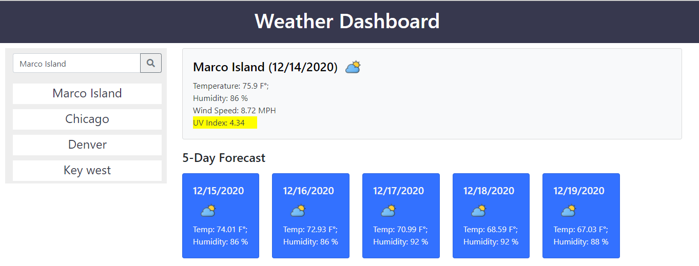

# 06 Server-Side APIs: Weather Dashboard
### Weather-Dashboard

Demonstrate the use of third-pary APIs to allow developers to access their data.  This applicaion will use the  [OpenWeather API](https://openweathermap.org/api) to fetch the current and forecasted weather for the city selected.  

The weather-dashboard utilize the `localStorage` to retrieve the last city searched and dynamically update the CSS to show the weather type (sunny, cloudy..) with a representative icon.  (Acknowlegment of those icons by, Icons made by Those Icons from www.flaticon.com)


## User Story

```
As a user this dashboard will show the weather and the forecast for a selected city.  Each city searched 
will be added to a list and can be selected again later.
The list is clickable or the user can can type in the city name and click the search button.  
The city name is checked to verify it is a valid entry.

```



## Technical Features Include

```
- Ajax API calls, checking for success and failure of the call
- Local storage for the last city search and display this city the next time the application is run
- Dynamic addition to a clickable list, including adding the event listener to each list item
- Uitilize icons from Flat Icon and special math symbols from javascripter.com
- Include the use of bootstrap cards
- Color coded UV index presentation based on city UV index value
```

## Application Direct Link Hosted by Github

[Weather-Dashboard](https://bootcampdev.github.io/weather-dashboard/)


